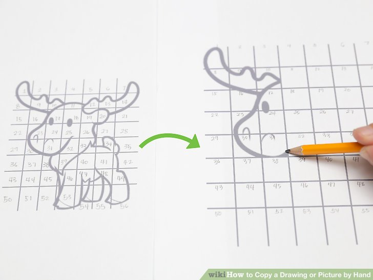

## 1、javaScript的变量类型
（1）基本类型：
5种基本数据类型Undefined、Null、Boolean、Number 和 String，变量是直接按值存放的，存放在栈内存中的简单数据段，可以直接访问。

（2）引用类型：
存放在堆内存中的对象，变量保存的是一个指针，这个指针指向另一个位置。当需要访问引用类型（如对象，数组等）的值时，首先从栈中获得该对象的地址指针，然后再从堆内存中取得所需的数据。

> JavaScript存储对象都是存地址的，所以浅拷贝会导致 obj1 和obj2 指向同一块内存地址。改变了其中一方的内容，都是在原来的内存上做修改会导致拷贝对象和源对象都发生改变，而深拷贝是开辟一块新的内存地址，将原对象的各个属性逐个复制进去。对拷贝对象和源对象各自的操作互不影响。

例如：数组拷贝

```
//浅拷贝，双向改变,指向同一片内存空间
var arr1 = [1, 2, 3];
var arr2 = arr1;
arr1[0] = 'change';
console.log('shallow copy: ' + arr1 + " );   //shallow copy: change,2,3
console.log('shallow copy: ' + arr2 + " );   //shallow copy: change,2,3
```
## 2、浅拷贝的实现
### 2.1、简单的引用复制###
```
function shallowClone(copyObj) {
  var obj = {};
  for ( var i in copyObj) {
    obj[i] = copyObj[i];
  }
  return obj;
}
var x = {
  a: 1,
  b: { f: { g: 1 } },
  c: [ 1, 2, 3 ]
};
var y = shallowClone(x);
console.log(y.b.f === x.b.f);     // true
```
### 2.2、Object.assign()
Object.assign() 方法可以把任意多个的源对象自身的可枚举属性拷贝给目标对象，然后返回目标对象。

```
var x = {
  a: 1,
  b: { f: { g: 1 } },
  c: [ 1, 2, 3 ]
};
var y = Object.assign({}, x);
console.log(y.b.f === x.b.f);     // true
```
## 3、深拷贝的实现
### 3.1、Array的slice和concat方法
Array的slice和concat方法不修改原数组，只会返回一个浅复制了原数组中的元素的一个新数组。**之所以把它放在深拷贝里，是因为它看起来像是深拷贝。而实际上它是浅拷贝**。原数组的元素会按照下述规则拷贝：

* 如果该元素是个对象引用 （不是实际的对象），slice 会拷贝这个对象引用到新的数组里。两个对象引用都引用了同一个对象。如果被引用的对象发生改变，则新的和原来的数组中的这个元素也会发生改变。
* 对于字符串、数字及布尔值来说（不是 String、Number 或者 Boolean 对象），slice 会拷贝这些值到新的数组里。在别的数组里修改这些字符串或数字或是布尔值，将不会影响另一个数组。

如果向两个数组任一中添加了新元素，则另一个不会受到影响。例子如下：

```
var array = [1,2,3]; 
var array_shallow = array; 
var array_concat = array.concat(); 
var array_slice = array.slice(0); 
console.log(array === array_shallow); //true 
console.log(array === array_slice); //false，“看起来”像深拷贝
console.log(array === array_concat); //false，“看起来”像深拷贝
```
可以看出，concat和slice返回的不同的数组实例，这与直接的引用复制是不同的。而从另一个例子可以看出Array的concat和slice并不是真正的深复制，数组中的对象元素(Object,Array等)只是复制了引用。如下：

```
var array = [1, [1,2,3], {name:"array"}]; 
var array_concat = array.concat();
var array_slice = array.slice(0);
array_concat[1][0] = 5;  //改变array_concat中数组元素的值 
console.log(array[1]); //[5,2,3] 
console.log(array_slice[1]); //[5,2,3] 
array_slice[2].name = "array_slice"; //改变array_slice中对象元素的值 
console.log(array[2].name); //array_slice
console.log(array_concat[2].name); //array_slice
```
### 3.2、JSON对象的parse和stringify
JSON对象是ES5中引入的新的类型（支持的浏览器为IE8+），JSON对象parse方法可以将JSON字符串反序列化成JS对象，stringify方法可以将JS对象序列化成JSON字符串，借助这两个方法，也可以实现对象的深拷贝。

```
//例1
var source = { name:"source", child:{ name:"child" } } 
var target = JSON.parse(JSON.stringify(source));
target.name = "target";  //改变target的name属性
console.log(source.name); //source 
console.log(target.name); //target
target.child.name = "target child"; //改变target的child 
console.log(source.child.name); //child 
console.log(target.child.name); //target child
//例2
var source = { name:function(){console.log(1);}, child:{ name:"child" } } 
var target = JSON.parse(JSON.stringify(source));
console.log(target.name); //undefined
//例3
var source = { name:function(){console.log(1);}, child:new RegExp("e") }
var target = JSON.parse(JSON.stringify(source));
console.log(target.name); //undefined
console.log(target.child); //Object {}
```
这种方法使用较为简单，可以满足基本的深拷贝需求，而且能够处理JSON格式能表示的所有数据类型，但是对于正则表达式类型、函数类型等无法进行深拷贝(而且会直接丢失相应的值)。还有一点不好的地方是它会抛弃对象的constructor。也就是深拷贝之后，不管这个对象原来的构造函数是什么，在深拷贝之后都会变成Object。同时如果对象中存在循环引用的情况也无法正确处理。

## 4、jQuery.extend()方法源码实现
[jQuery的源码 - src/core.js #L121](https://github.com/jquery/jquery/blob/1472290917f17af05e98007136096784f9051fab/src/core.js#L121)源码及分析如下：

```
jQuery.extend = jQuery.fn.extend = function() { //给jQuery对象和jQuery原型对象都添加了extend扩展方法
  var options, name, src, copy, copyIsArray, clone, target = arguments[0] || {},
  i = 1,
  length = arguments.length,
  deep = false;
  //以上其中的变量：options是一个缓存变量，用来缓存arguments[i]，name是用来接收将要被扩展对象的key，src改变之前target对象上每个key对应的value。
  //copy传入对象上每个key对应的value，copyIsArray判定copy是否为一个数组，clone深拷贝中用来临时存对象或数组的src。

  // 处理深拷贝的情况
  if (typeof target === "boolean") {
    deep = target;
    target = arguments[1] || {};
    //跳过布尔值和目标 
    i++;
  }

  // 控制当target不是object或者function的情况
  if (typeof target !== "object" && !jQuery.isFunction(target)) {
    target = {};
  }

  // 当参数列表长度等于i的时候，扩展jQuery对象自身。
  if (length === i) {
    target = this; --i;
  }
  for (; i < length; i++) {
    if ((options = arguments[i]) != null) {
      // 扩展基础对象
      for (name in options) {
        src = target[name];	
        copy = options[name];

        // 防止永无止境的循环，这里举个例子，
            // 如 var a = {name : b};
            // var b = {name : a}
            // var c = $.extend(a, b);
            // console.log(c);
            // 如果没有这个判断变成可以无限展开的对象
            // 加上这句判断结果是 {name: undefined}
        if (target === copy) {
          continue;
        }
        if (deep && copy && (jQuery.isPlainObject(copy) || (copyIsArray = jQuery.isArray(copy)))) {
          if (copyIsArray) {
            copyIsArray = false;
            clone = src && jQuery.isArray(src) ? src: []; // 如果src存在且是数组的话就让clone副本等于src否则等于空数组。
          } else {
            clone = src && jQuery.isPlainObject(src) ? src: {}; // 如果src存在且是对象的话就让clone副本等于src否则等于空数组。
          }
          // 递归拷贝
          target[name] = jQuery.extend(deep, clone, copy);
        } else if (copy !== undefined) {
          target[name] = copy; // 若原对象存在name属性，则直接覆盖掉；若不存在，则创建新的属性。
        }
      }
    }
  }
  // 返回修改的对象
  return target;
};
```
jQuery的extend方法使用基本的递归思路实现了浅拷贝和深拷贝，但是这个方法也无法处理源对象内部循环引用，例如：

```
  var a = {"name":"aaa"};
  var b = {"name":"bbb"};
  a.child = b;
  b.parent = a;
  $.extend(true,{},a);//直接报了栈溢出。Uncaught RangeError: Maximum call stack size exceeded
```
## 5、自己动手实现一个拷贝方法
```
(function ($) {
    'use strict';

    var types = 'Array Object String Date RegExp Function Boolean Number Null Undefined'.split(' ');

	function type () {
	   return Object.prototype.toString.call(this).slice(8, -1);
	}

	for (var i = types.length; i--;) {
	    $['is' + types[i]] = (function (self) {
	        return function (elem) {
	           return type.call(elem) === self;
	        };
	    })(types[i]);
	}

    return $;
})(window.$ || (window.$ = {}));//类型判断

function copy (obj,deep) { 
    if ($.isFunction(obj)) {
    	return new Function("return " + obj.toString())();
    } else if (obj === null || (typeof obj !== "object")) { 
        return obj; 
    } else {
        var name, target = $.isArray(obj) ? [] : {}, value; 

        for (name in obj) { 
            value = obj[name]; 

            if (value === obj) {
            	continue;
            }

            if (deep) {
                if ($.isArray(value) || $.isObject(value)) {
                    target[name] = copy(value,deep);
                } else if ($.isFunction(value)) {
                    target[name] = new Function("return " + value.toString())();
                } else {
            	    target[name] = value;
                } 
            } else {
            	target[name] = value;
            } 
        } 
        return target;
    }　        
}
```

